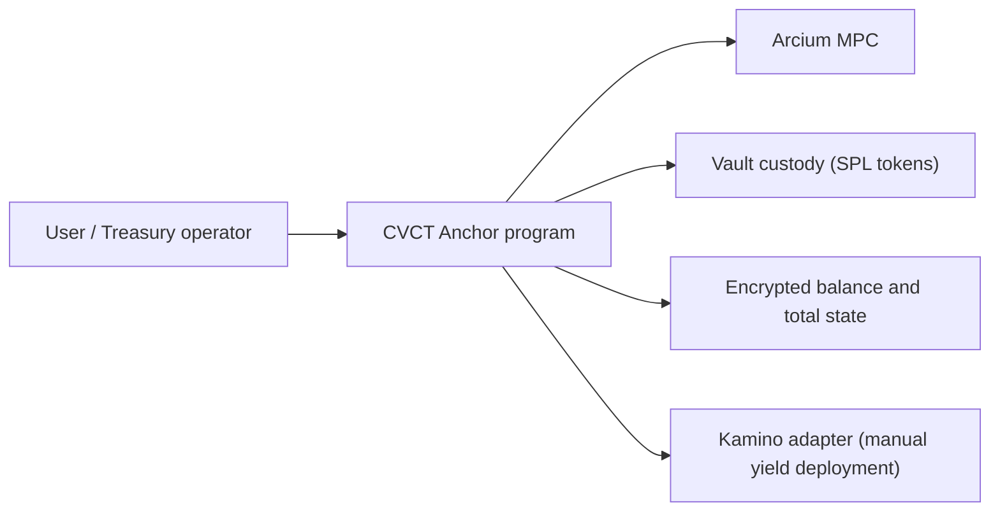
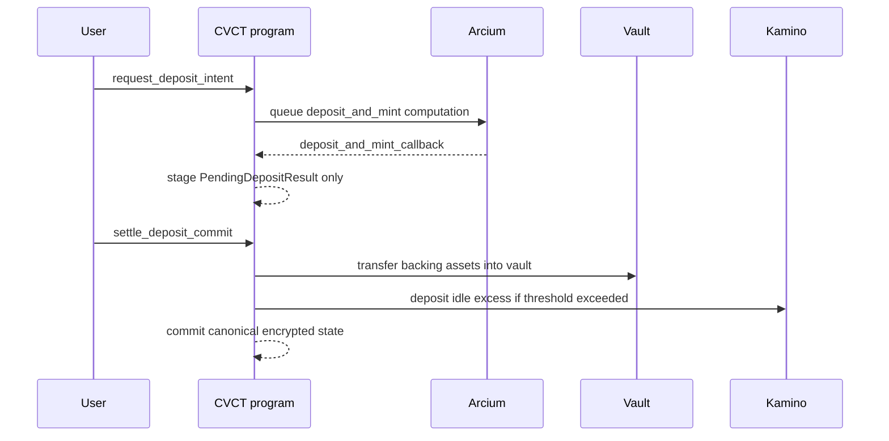
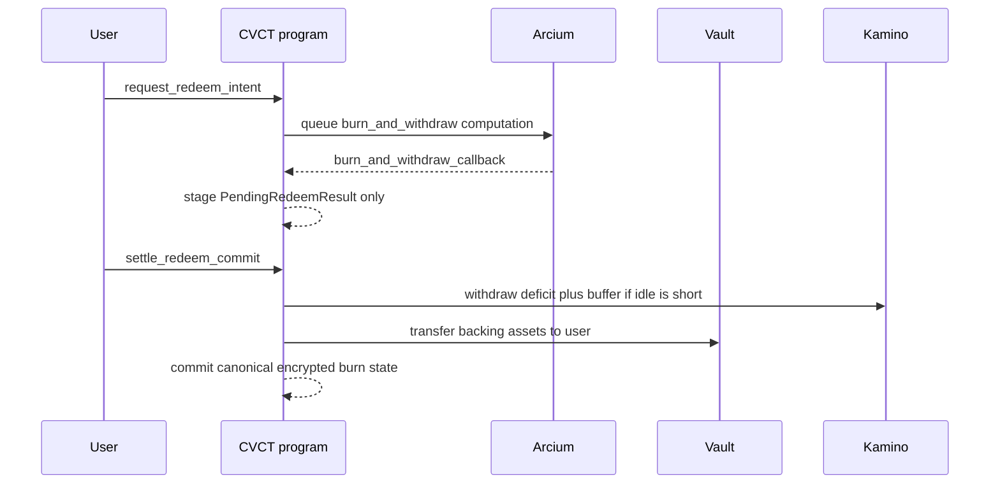

# Architecture

## Overview

CVCT is a private yield treasury protocol for Solana.

The current implementation uses a confidential, vault-backed share ledger to support that product direction. It separates three concerns:
- `Custody`: real SPL assets live in vault-controlled token accounts on Solana
- `Accounting`: balances and global totals are encrypted and updated through Arcium MPC
- `Settlement`: canonical confidential state only commits when the corresponding custody step succeeds

That separation is the core architectural decision in this codebase.

The important framing is:
- the product is private treasury and private balance management with yield
- MPC is the accounting/privacy layer, not the product itself

## Design principles

### 1. Canonical state must not move early
Callbacks stage results. They do not directly commit user-facing accounting state for deposit and redeem.

### 2. Stale work should invalidate, not overwrite
If pricing or user balance changed underneath a staged operation, the operation becomes invalid instead of clobbering newer state.

### 3. Treasury logic should stay outside user hot paths
Kamino treasury deployment is explicit and manual. It is not embedded inside deposit or redeem settlement.

### 4. Cleanup should be explicit
Operation-purpose PDAs remain inspectable after terminal completion and can then be closed permissionlessly with rent returned to the operation owner.

## High-level component model

## Main accounts

### `CvctMint`
Confidential share-ledger metadata.

Holds:
- backing SPL mint reference
- encrypted `total_supply`
- nonce for encrypted supply

### `Vault`
Confidential treasury asset metadata.

Holds:
- backing SPL mint
- vault authority / vault token routing context
- encrypted `total_locked`
- nonce for encrypted locked assets

### `PricingState`
Global optimistic concurrency guard for price-sensitive treasury operations.

Holds:
- `cvct_mint`
- `pricing_version`

`pricing_version` increments only when canonical pricing state changes, such as:
- successful deposit commit
- successful redeem commit
- changed `sync_total_assets`
- changed `sync_total_assets_from_adapter`

No-op sync does not increment it.

### `CvctAccount`
Per-user confidential balance account.

Holds:
- owner
- mint reference
- encrypted balance
- nonce for encrypted balance
- `balance_version`

`balance_version` is the per-account concurrency guard used to prevent transfers or staged operations from overwriting newer balance state.

### `PendingOperation`
Shared request lifecycle account for deposit and redeem.

Holds:
- operation identity and routing metadata
- operation kind (`Deposit` or `Redeem`)
- status
- staged outcome summary (`ok`, `amount_out`, `computed_at_slot`)
- concurrency snapshots:
  - `base_pricing_version`
  - `base_user_balance_version`

### `PendingDepositResult`
Staged deposit output.

Holds:
- staged encrypted user balance
- staged encrypted total supply
- staged encrypted total locked
- `shares_out`
- callback metadata
- version snapshots used to validate staleness

### `PendingRedeemResult`
Staged redeem output.

Same pattern as `PendingDepositResult`, but stores `assets_out`.

### `PendingTransferResult`
Staged transfer output.

Holds:
- initiating user
- sender and recipient account identities
- staged sender/recipient balances
- callback result flag
- base sender/recipient balance versions

### `KaminoAdapterState`
Manual yield adapter configuration.

Holds:
- mint reference
- Kamino vault state and required PDA addresses
- KLend program reference
- enable/disable flag

The adapter is Kamino-specific. The code treats Kamino program identity as pinned, not operator-configurable.

## Deposit architecture

### Why this matters
The old "move funds first, compute later" pattern creates unresolved custody windows.

The current deposit path avoids that:
- request records intent only
- callback stages output only
- settlement commits custody and accounting together

In product terms, deposit is a treasury funding flow into private internal balances.

When the Kamino adapter is enabled, deposit settlement also becomes the protocol-owned deploy step for excess idle liquidity.

## Redeem architecture

### Low-liquidity redeem handling
A redeem can reach `ComputedSuccess` while idle vault liquidity is insufficient.

In that case:
- settlement first attempts a Kamino pull sized as `deficit + redeem buffer`
- canonical confidential state changes only after payout succeeds
- if the pull still cannot satisfy the payout, settlement returns `InsufficientIdleLiquidity`
- settlement can be retried safely

In product terms, redeem is a private internal balance being converted back into spendable assets without forcing treasury deployment into the same hot path.

## Transfer architecture

Transfer stays simpler than deposit and redeem:
- request transfer computation
- callback writes the result if both sender and recipient account versions still match
- stale callbacks are ignored instead of overwriting newer balances

Failed transfers:
- record `ok = false` in `PendingTransferResult`
- do not mutate canonical balances
- do not bump `balance_version`

This is the primitive that makes private desk allocation, contributor balances, grant balances, or payroll balances workable without exposing them on-chain.

## Concurrency model

CVCT uses optimistic concurrency at two layers.

### Pricing concurrency
Used for price-sensitive operations.

Guard account:
- `PricingState.pricing_version`

Deposit and redeem requests snapshot the current pricing version. Callback and settlement invalidate if the live version no longer matches.

### User balance concurrency
Used for same-user balance mutation safety.

Guard field:
- `CvctAccount.balance_version`

Deposit and redeem requests snapshot the user's current balance version. Transfer snapshots sender and recipient versions. Callback or settlement invalidates when the live version changed underneath the staged result.

## Cleanup model

Terminal operation accounts are closed explicitly.

Instructions:
- `cleanup_terminal_deposit`
- `cleanup_terminal_redeem`
- `cleanup_transfer_result`

Behavior:
- cleanup is permissionless
- lamports return to the operation owner
- PDAs remain inspectable until cleanup is called

This keeps operational introspection and rent recovery separate.

## Events

The program emits three main lifecycle events:
- `OperationRequestedEvent`
- `OperationComputedEvent`
- `OperationSettledEvent`

They are useful for off-chain indexing, but the account state remains the source of truth.

## Share math

The protocol uses share-based accounting with virtual offsets.

Conceptually:
- deposits mint shares from assets
- redeems burn shares into assets
- the exchange rate is based on encrypted `total_supply` and `total_locked`

The circuit verifies the caller/backend quote against the confidential state rather than trusting it blindly.

This matters because CVCT should behave like a private yield-bearing treasury ledger, where the exchange rate between shares and assets is part of the system's economic truth.

## What the architecture is optimized for

- privacy of internal balances and aggregate treasury state
- deterministic settlement semantics
- safe invalidation of stale work
- explicit yield deployment and treasury management
- testable, decomposed lifecycle behavior

## What it does not optimize for yet

- minimum-UX public APIs (`min_out`-only user surface is still future work)
- automatic treasury rebalancing
- shielded in / shielded out cash movement
- minimal local integration runtime

Those are follow-on concerns. The current codebase prioritizes correctness and observability.
